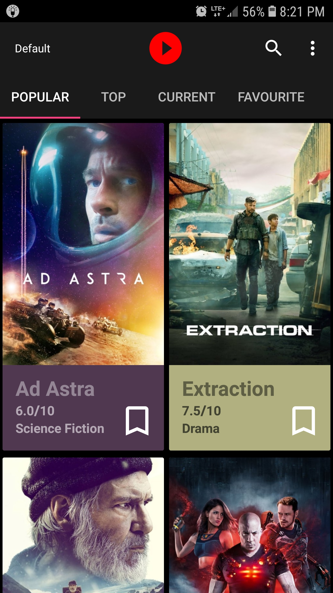
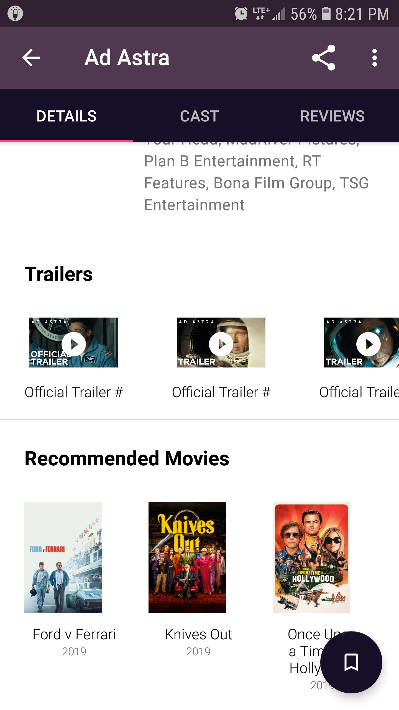
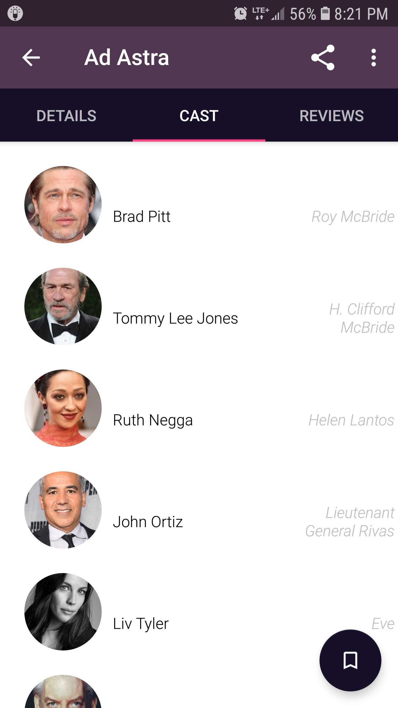
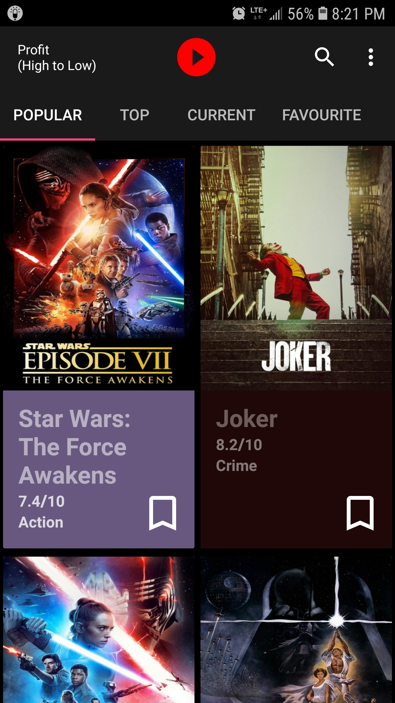

# Popcorn

Popcorn is an Android app that allows users to view the most popular, top, and current movies.
Upon pressing a movie, additional details such as director, revenue, case, etc. are displayed.
At the bottom of each movie are trailers and recommendations.
This app also includes a feature to save movies for future offline viewing.

API keys for TheMovieDatabase (TMDb) and YoutubePlayer are needed.  To get the former,
go to https://www.themoviedb.org and for latter go to https://developers.google.com/youtube/android/player.
Insert these keys into Popcorn/gradle.properties in the appropriate quotations.  Quotations are kept.

 
 
 

App upon opening.

 
 
 

Displaying trailers and recommendations of a movie.

 
 
 

Additional info of a movie (here it is cast).

 
 
 

Popular movies sorted from highest profit to lowest profit.

